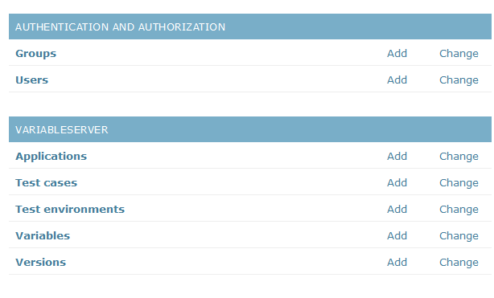
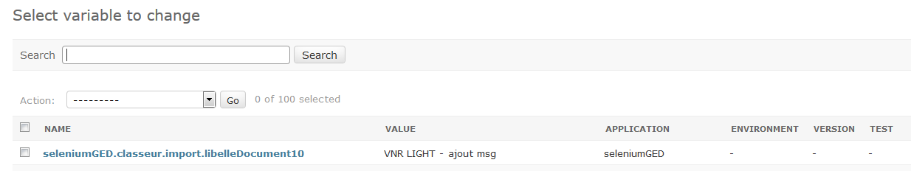
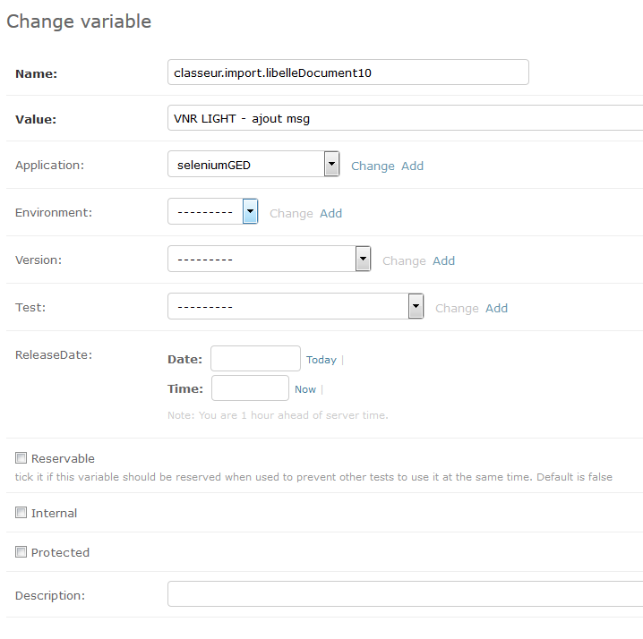
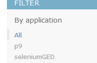

# seleniumRobot-server #
Server that supports seleniumRobot executions
Features:
- serves variables for seleniumRobot tests
- store test results if requested
- store and compare snapshots if requested

# Build #
For now, build is done through the python script `build.py`. Ite generates a zip file which you only need to unzip

# Installation #
- python3 install
- apache install
    - apache from apachelounge, same bitness as python
    - C++ redistributable microsoft, same version as the one used for apache compilation
    - mod_wsgi, same bitness as python
- configure Apache server with

	LoadFile "<path_to_python_dll>"
	LoadModule wsgi_module "<python_dir>/lib/site-packages/mod_wsgi/server/mod_wsgi.cp36-win32.pyd"
	WSGIPythonHome "<python_dir>"
	
	WSGIScriptAlias / <path_to_selenium_server>/seleniumRobotServer/wsgi.py
	WSGIPythonPath <path_to_selenium_server>
	
	<Directory "<path_to_selenium_server>/seleniumRobotServer">
	<Files wsgi.py>
	Require all granted 	
	</Files>
	</Directory>
	
	Alias /media/ <path_to_selenium_server>/media/
	Alias /static/ <path_to_selenium_server>/static/
	
	<Directory "<path_to_selenium_server>/static">
	Require all granted
	</Directory>
	
	<Directory "<path_to_selenium_server>/media">
	Require all granted
	</Directory>
	
	
for linux (RHE7)

	LoadFile "/opt/rh/rh-python34/root/lib64/libpython3.so.rh-python34"
	LoadModule wsgi_module "/opt/rh/httpd24/root/usr/lib64/httpd/modules/mod_rh-python34-wsgi.so"
	WSGIPythonHome "/opt/selenium-server/venv"
	
	WSGIScriptAlias / /opt/selenium-server/seleniumRobotServer/wsgi.py
	WSGIPythonPath /opt/selenium-server/venv/lib/python3.4/site-packages/:/opt/selenium-server
	
	<Directory "/opt/selenium-server/seleniumRobotServer">
	<Files wsgi.py>
	Require all granted
	</Files>
	</Directory>
	
	Alias /media/ /opt/selenium-server/media/
	Alias /static/ /opt/selenium-server/static/
	
	<Directory "/opt/selenium-server/static">
	Require all granted
	</Directory>
	
	<Directory "/opt/selenium-server/media">
	Require all granted
	</Directory>
	
	
	
	
- install Postgre database (if not using a centralized database or SQLite)
- for linux (RHE7 here), install `freetype-devel`, `libpng-devel`, `gcc-c++`, `python3-devel`, `libjpeg-turbo-devel`
- deploy files: unzip seleniumRobotServer.zip
- install python requirements: `pip install -r requirements.txt` 
- database migration: `python manage.py migrate`
- database fix: `python manage.py fix_permissions`
- create super user on first deploy **ONLY**: `python manage.py createsuperuser`. If using AD/LDAP, use `python manage.py ldap_promote <user>` instead

# Configuration # 

- change settings accordingly into settings.py (replace `${var}` variables)
- to use AD/LDAP authentication, uncomment `AUTHENTICATION_BACKENDS = ("django_python3_ldap.auth.LDAPBackend",)` and configure LDAP values
- to use SQLite instead of Postgre: comment the right default database in `DATABASES`

# Usage #

## User interface ##

### Variable Server ###
To access variable server go to `http://<server>:<port>/admin/`
Depending on your rights, you will be able to configure only variable server assets (application, test case, environment, variable and version) with `Variable Users` group or anything with admin rights

for each type of asset, behaviour is the same:

#### consult list of assets ####
Click on the asset type to access its list

#### edit asset ####
From there, click on one of the variable to modify it

#### filter list ####
Because there may be plenty of variables for your test, you can filter by application, version, environment, ...
Display will take this filter into account to reduce the number of variables displayed

It's also possible to search for some variable
**Search is done in name and value of variables**

#### add an asset ####

Clicking on `Add <asset>` allow you to create a new asset 

From there, it's also possible to add some dependencies. For example, if your variable is associated to a new TestCase, create it from this screen

##### specific to variables #####

- *reservable*: means that several variable (same name, environment, version, ...) can be defined with different values. Fro example, you have a username that cannot be used by several test scripts at the same time. So you define multiple username for that environment/application. Then, seleniumRobot reserve on of this username so it cannot be used by other tests. When test ends, this variable is released (or after 15 mins by default)
- *internal*: this variable has been created by seleniumRobot for internal use. **Do not edit**
- *protected*: value should not be displayed to non admin users or users that do not have the `Can see protected vars` right (e.g: passwords)

### Snapshot server ###

This server aims at storing test snapshots to compare them

**TBC**

## API ##

Usage is the same for all API (example for version)
- `GET http://<server>:<port>/commons/api/version/2/` => get version by id
- `POST http://<server>:<port>/commons/api/version/` => add version. Request data should contain all mandatory fields
- `PATCH http://<server>:<port>/commons/api/version/2/` => change version by id. Request data should contain only updated fields
- `PUT http://<server>:<port>/commons/api/version/2/` => change version by id. Request data should contain all fields
- `DELETE http://<server>:<port>/commons/api/version/2/` => delete the version by id

### commons ###

- `/commons/api/gversion/?name=<>`: get version by name
- `/commons/api/gapplication/?name=<>`: get application by name
- `/commons/api/genvironment/?name=<>`: get environment by name
- `/commons/api/gtestcase/?name=<>`: get test case by name
- `/commons/api/version/`: get/post version by id
- `/commons/api/application/`: get/post application by id
- `/commons/api/environment/`: get/post environment by id
- `/commons/api/testcase/`: get/post test case by id

### variables ###

#### get all variables ####

To get variables from server: `http://<server>:<port>/variable/api/variable?version=7&environment=1&test=8&format=json`

Ids can be found through user interface. 

`format=json` is mandatory so that getting variable list is not done twice, thus reserving variables twice

#### create variable ####

	POST http://<server>:<port>/variable/api/variable?name=<name>&value=<value>&reservable=<true_or_false>&environment=<env_id>&application=<app_id>&internal=<true_or_false>&destroyAfterDays=<time_to_live_in_days>
	
- `name`: name of the variable
- `value`: value assigned to variable
- `reservable`: (optional) if true, variable will be reserved by server when getting the list. This means that during 15 minutes, it won't be usable for other test if not released
- `timeToLive`: (optional) if value is greater than 0, variable will be destroyed after N days
- `environment`: (optional) id of the environment this variable is assigned to
- `application`: (optional) id of the application this variable is assigned to
- `version`: (optional) id of the version this variable is assigned to
- `test`: (optional) id of the test case this variable is assigned to
- `internal`: (optional) true or false. If true, indicates that this variable has been created by test scenarios for reuse only. These are not test datav
#### get only old variable ####

It's possible to get variables older than X days using olderThan parameter:

	GET http://<server>:<port>/variable/api/variable?version=7&environment=1&test=8&olderThan=2&format=json

This is useful when robot creates variables during a test, for reuse in an other one and created variable cannot be used directly. Concrete case:

- you create a user
- store this user id in variable server, but your application won't allow you to consult this user immediately (e.g: it needs some batch to be fully integrated in database)
- have a test that needs a valid user, created some days before

#### destroy temp variables automatically ####

When test creates variables, it may be useful to destroy these variables after some time to avoid a database growth.
You can set a time to live to a variable using the `destroyAfterDays` parameterng  

	

